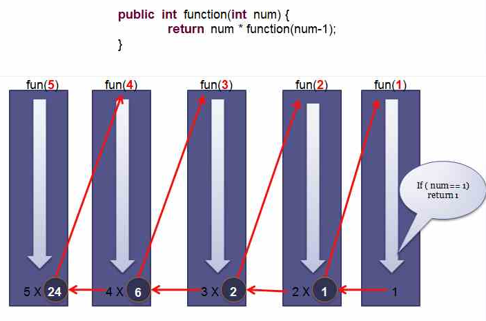

[TOC]

#函数Function
##了解函数
函数就是把特定功能的代码抽取出来并进行封装，用来重复执行一些功能，并起个名字（函数名）。函数对任何语言来说都是一个核心的概念。通过函数可以封装任意多条语句，而且可以在任何地方、任何时候调用执行

* 使用函数的好处，为什么要使用函数
    - 函数可以重复执行某一部分代码（通过函数名调用）
    - 使程序变得更简短而清晰
    - 有利于程序维护
* 什么时候需要函数
    - 当相同的代码出现多次时
    - 当需要提取公共代码时 


##函数的定义
* 关键字声明（声明式）：
格式：`function 函数名(){}`
```
function sum(){}
```
>函数的声明会提前 ==> 解析器会率先读取函数声明，并使其在执行任何代码之前可用（可以访问）;

* 函数表达式(赋值式)
```
var sum = function(){}
```

* 匿名函数：
没有名字的函数就叫匿名函数

##函数的执行
1. 手动调用:
`sum();`
2. 事件驱动:
格式：元素.事件 = 函数名;
`buton.onclick = sum;`

###常见事件触发函数
* onclick：点击事件
* ondblclick：双击事件
* onmouseover：鼠标移入事件
* onmouseout:鼠标移开事件
* onchange：内容改变事件（一般用于表单元素）
* onkeyup：键盘按键弹起事件

###常用内置函数
javascript内部事先定义好的函数

##声明提前
* 函数声明提前
* 变量声明提前
>声明但没有赋值的变量默认为undefined

```
var a = 10;
function test(){
    console.log(a);
    var a=20;
}
test() ==> 会得到什么信息？
```

##作用域
>俗称“使用范围”，即能够使用某个变量的范围，分<全局作用域>和<局部作用域>

* 全局变量与局部变量
    - 全局变量：在全局作用域下声明的变量，可以在任意地方中使用，作用范围比较大，我们称为全局变量
    - 局部变量：在函数内（局部作用域）声明的变量，只在函数中可以使用，作用范围较小，我们称之为局部变量
* 变量的访问规则
    - 就近原则（如查找变量a）：
        + 使用变量a时先从当前函数查找，如果当前函数有变量a则使用;
        + 如果当前函数无变量a,则往父级函数查找，如果找到则使用，并停止查找;
        + 如果在父级函数还是无法找到，则继续往上一层函数查找，以此类推，直到最顶层(全局作用域)，如果还是没找到，则报not defined错误;
    - 作用域链：每个函数在定义时就形成了局部作用域，如果存在多个函数嵌套，他们之间就会建立起某种联系，直到全局作用域，这种联系称之为作用域链。当函数访问变量时，根据就近原则在这个作用域链中从内到外查询变量。

---

**[案例]**

1. 封装一个得到1-100随机整数的函数
2. 封装一个函数factorial，实现任意数字阶乘的计算
>要求：页面输入任意数字，点击按钮后计算阶乘
3. 封装一个显示隐藏页面元素的函数
4. 编写生成4位数字验证码的函数，并显示在页面，点击重新生成验证码


**[练习]**

1. 封装一个函数，计算任意两个数字的加减乘除
2. 编写一个函数，计算三个数字的大小，按从小到大顺序输出
3. 封装生成表格函数，根据输入的行或列得到一个表格

**[作业]**

1. 编写一个函数，计算任意两个数字之间所能组成的奇数个数，参数数字必须是个位数
比如： 计算0-3之间能组成的奇数是01、21、03、13、23、31
    * 不能单个数字本身进行组合，如11,33

---


##函数的参数
* 形参，就是局部变量
* 形参与实参的区别:
    - 形参：声明函数时圆括号内定义的变量
    - 实参：函数执行时传入的参数
>形参和实参的数量可以不同
    
* arguments
函数内部隐藏的对象（是一个类数组），保存着实参的信息
    - length: 实参的数量

* 引用数据类型与基本数据类型的传参（引用传递与值传递）
    - 函数作为参数传递

##函数返回值
1. 终止函数的执行,return后的代码不会执行
2. return后如果有值，则把这个值返回到函数执行的地方
>如果函数没有return,执行完后返回undefined

##函数中的this
函数中的this是一个关键字，表示当前对象，而当前对象是谁，取决于谁调用了这个函数

##函数递归 
函数可以自己调用自己, 成为函数的递归调用

递归调用的过程: 

1. 首先去找临界值，即无需计算，获得的值(一般是返回该值)。
2. 找这一次和上一次的关系(一般从后往前找)
3. 假设当前函数已经可以使用，调用自身计算上一次的运行结果，再写出这次的运行结果。



##封装常用函数

---

**[案例]**

1. 封装一个函数，计算所有传入参数的和
2. 编写一个函数，输入n为偶数时，调用函数求1/2+1/4+...+1/n,当输入n为奇数时，调用函数求1+1/3+...+1/n
3. 封装生成随机颜色函数
4. 利用递归求100的阶乘
5. 递归实现斐波那契数列

**[练习]**

1. 封装计算平方与立方的方法
2. 封装获取某个范围内随机数的方法
3. 根据传进的参数得到最大值

**[作业]**

1. 某个公司采用公用电话传递数据，数据是四位的整数，在传递过程中是加密的，加密规则如下：每位数字都加上5,然后用除以10的余数代替该数字，再将第一位和第四位交换，第二位和第三位交换，请编写一个函数，传入原文，输出密文
2. 年月日分别为自定义函数的参数，判断是否为正确的日期
>错误日期：2016-11-31,2017-2-29,2016-13-20,2015-8-38

[扩展]

1. 计算器


---
##下节预习
* 数组Array
