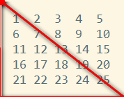

[TOC]

#数组Array
##什么叫数组
一系列数据的集合，每一项可以保存任何类型的数据，称为数组的元素，每个元素之间用逗号隔开
>数组格式：[1,2,3]

##数组创建方式
```javascript
//1)字面量(推荐)
var arr = [1,2,3];

//2)使用构造函数创建
var arr = new Array();//创建一个空数组
var arr = new Array(7);//创建一个长度为7的数组（数组项都为undefined）
var arr = new Array('王大锤',18 ,'普通青年','广州');//创建数组并同时写入数据
```

##数组操作

###数组访问与写入
* 索引（下标）：从0开始
``` javascript
var arr = ['html5','css3','javascript'];

//访问
arr[0]; //=> 'html5'
arr[2]; //=> 'javascript'

//写入
arr[3] = 'web前端';
```


* length：表示数组的长度
`arr.length; //=> 3`

###数组遍历
* for循环
格式：for(变量初始化;判断条件;变量更新){执行语句}
```javascript
var arr = ['html5','css3','javascript'];
for(var i=0;i<arr.length;i++){
    console.log(arr[i]);
}
```


###数组方法
* push： 往数组尾部添加一个或多个元素，返回数组新的长度
* pop：删除数组最后一个元素，返回删除的元素
* unshift：往数组开头添加一个或多个元素，返回数组新的长度
* shift：删除数组第一个元素，返回删除的元素
* splice(start,deleteNum,...items)：在数组中插入、删除、替换的通用方法
    - start：起始索引位置
    - deleteNum：要删除的数量
    - items：插入的元素（可以是多个）
* slice(start[,end])：返回数组的片段或子数组，从start开始到end(不包括end所对应的元素)
>如果省略end参数，则截取到数组的最后一项
支持负数
* sort：将数组中的元素排序，并返回排序后的数组
>默认以字符串的排列方式（转换成ASCII码进行对比）
* reverse：将数组中的元素颠倒顺序，返回逆序后的数组
* join(separator) 返回字符串值，其中包含了连接到一起的数组的所有元素
    - separator为分隔符，默认为逗号
* concat() 返回一个新数组，这个新数组是由调用这个方法的数组和参数组成
>参数可以是多个

##数组排序
* 冒泡排序法
    - 当前元素跟下一个元素对比
    - 把最大的逐个往后排列
* 选择排序法
    - 把当前元素分别跟后面的元素对比
    - 把最小的逐个往前排列
* 快速排序法
    - 利用递归实现

```
//分别用冒泡/选择排序法排列以下数据
[10,2,8,55,32,18,9,11,30,16,19,20]
```


##值类型与引用类型的区别
[内存中的状态]

###数组复制与传输
* 如何复制数组
* 把数组作为函数的参数


###多维数组(数组里面包含数组)
```javascript
var arr = [1,2,'html5',[3,4,'css3'],[5,6,'javascript']]
arr[3][2]; //=>'css3'
```

---

**[案例]**

* 创建一个包含50个三位数的随机数组
* 随机点名程序（简单版）
* 找出以下数组中所有小于10的元素并组成一个新的数组
[10,15,2,32,5,4,20,8,48,54,6]
* 编写一个map(arr)函数，把数组中的每一个数字都增加20%，并返回新的数组

**[练习]**

1. 编写一个has(arr,60)函数，判断arr数组中是否包含60这个数
2. 有一个从小到大排序的数组[3,5,6,20,22,33,88]。现输入一个数，要求按原来的规律将它插入数组中，并打印出新的数组
3. 定义一个含有30个整型元素的数组，按顺序分别赋予从2开始的偶数；然后按顺序每五个数求出一个平均值，放在另一个数组中并输出。试编程。

---

#对象Object
##创建对象
* 字面量（推荐）：`var obj = {name:'小明',age:18}`
* 构造函数：`var obj = new Object(); `

##读取属性值
`obj.name;//==>小明`
>如果读取一个不存在的属性，返回undefined

##添加属性
```javascript
    obj.sex = '男';
    obj.marry = false;
    obj['weight'] = 60
```

##删除属性
```javascript
    var obj = {name:'laoxie',age:18,gender:'man'}

    //删除age属性
    delete obj.age;
```

##遍历对象for...in
```javascript
    var obj = {
        name:'laoxie',
        age:18
        gender:'男'
    }

    //遍历对象
    for(var attr in obj){
        //遍历过程把每次把对象属性赋值给attr
        //所以获取对象属性值为：obj[attr]
        document.write(obj[attr]);//分别输出：'laoxie',18,'男'
    }
```

##数组与对象的组合
```javascript
    [{
        id:'001',
        name:'iphone7 plugs',
        imgurl:'img/ip7.jpg',
        price:5899.00,
        sale:5888.00,
        color:'土豪金'
    },{
        id:'002',
        name:'Note7',
        imgurl:'img/note7.jpg',
        price:3899.00,
        sale:998.00,
        color:'黑色'
    },{
        id:'003',
        name:'荣耀7',
        imgurl:'img/honor7.jpg',
        price:1999.00,
        sale:1899.00,
        color:'白色'
    }]
```


#ECMAScript5(ES5)Array新增方法

###静态方法
* Array.isArray()
判断是否为数组，返回true/false

###索引方法
>区别就是一个从前往后找，一个从后往前找

* indexOf/lastIndexOf(keyword [,startIndex])
    - keyword: 要查找的项，
    - startIndex：查找起点位置的索引，该参数可选，默认0

    方法返回keyword所在数组中的索引值，如果数组不存在keyword，则返回-1

###迭代（遍历）方法

* forEach(fn)
遍历方法，for循环没有太大差别，比for循环方便
* map(fn)
返回一个数量相等的数组，内容是什么取决于在fn中返回的值
* filter(fn)
得到执行fn后返回true时对应的数组元素，利用这个方法可对数组元素进行过滤筛选
* some(fn)
如果该函数中任何一项返回 true，则返回true
* every(fn)
如果该函数对每一项都返回 true，则返回true

```
    以上方法都对数组中的每一项运行给定函数fn,，函数中有三个形参分别为
    - item：数组中的每一项,
    - index：遍历过程中对应的索引值,
    - array：对数组的引用
```

###归并方法
>这两个方法都会迭代数组中的所有项，然后生成一个最终返回值。

* reduce(fn,initVal)
* reduceRight(fn,initVal)
    - fn(prev,cur,index,array): fn是每一项调用的函数，函数接受4个参数分别是
        + prev：前一次返回值，
        + cur：当前值，
        + index：索引值，
        + array：当前数组，
        函数需要返回一个值，这个值会在下一次迭代中作为prev的值
    - initVal: 迭代初始值（可选），如果缺省，prev的值为数组第一项


---

**[案例]**

1. 分别计算出以上数组的最大值，最小值和平均值，并输出他们的索引
`[10,2,8,55,32,18,9,11,30,16,19,20]`
2. 显示最新输入的新闻信息

3. 根据数据生成一个商品列表

**[练习]**

1. 随机生成一个五位以内的数，然后输出该数共有多少位，每位分别是什么
2. 创建一个对象，用于存储一个学生的信息，该对象包含名字、学号、身份证、年龄、性别、所学专业等属性信息，同时该对象包含一个自我介绍的方法，用来输出该对象的所有信息
3. 通过循环按顺序为一个5×5的二维数组arr赋1到25的自然数，然后输出该数组的左下半三角的和。试编程。


**[作业]**

1. 编写一个norepeat(arr)去重函数，去掉数组中的重复项，并返回一个新的数组
2. 以下是某班级一次考试的成绩表。请计算每个学生总成绩，并按总成绩排名。统计各单科成绩第一名，输出其成绩与学号。

    |学号|语文|数学|英语|总成绩|备注|
    |:--:|----|----|----|------|----|
    |1   |105   |62  |118     
    |2   |89    |78  |120     
    |3   |86    |64  |80      
    |4   |78    |99  |91      
    |5   |107.5 |97  |70      
    |6   |112   |61  |92      
    |7   |101   |79  |104     
    |8   |71    |72  |105     
    |9   |56    |68  |61      
    |10  |98    |83  |77   

**[扩展]**

* 用数组实现斐波那契数列   

---
##下节预习
* 字符串String
