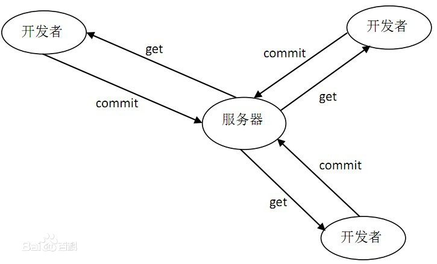
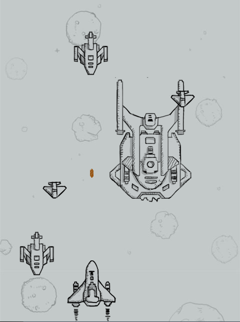

[TOC]

#版本管理

##版本的概念

##版本管理的好处及种类

* RCS（Revision Control System）
即程序改版控制系统，主要功能是用来管理文件的版本，可以节省空间和时间。这样就不需要在每个程序开发到某一个阶段就将数据拷贝到其他的地方备份起来了。
* CVS（Concurrent Version System）
现代管理里工具始祖
* SVN（Subversion）
集中式管理工具的集大成者
* GIT
分布式版本管理工具（后面讲解）

##SVN
SVN是Subversion的简称，是一个**集中式**代码管理版本控制系统，相较于RCS、CVS，它采用了分支管理系统，它的设计目标就是取代CVS。说得简单一点SVN就是用于多个人共同开发同一个项目，共用资源的目的。

**集中式：**
1. 需要中心服务器
2. 需要联网

###服务器安装
下载：https://www.visualsvn.com/downloads/

###客户端安装
下载：https://tortoisesvn.net/downloads.zh.html

###使用

####基本操作
* 迁出（SVN Checkout）：获取远程仓库(服务器)内容
>必须在非svn目录中操作
    - 拿到服务器仓库地址（URL of repository）
    - 获得用户名密码
* 更新（SVN Update）：同步文件
>当迁出相应目录后，如果他人对服务器上此目录内容进行了修改，则需要再次获取改动内容到本地目录的过程称为更新

* 提交(SVN Commit)：把本地修改提交到服务器
>每次提交前，都要先Update一下，确保更新到服务器最新版本后再提交
    - 填写关于本次更新的日志（log message），这是必填项，否则commit会失败
    - 每成功提交一次，SVN版本号自动加1

####其他操作
* 增加文件(Add)
* 检查更新（Check for modifications）
* 删除文件（Delete）
* 撤销更改（Revert）
* 锁定和解锁（Get lock and Release lock）
当项目需要时可以在本地硬盘中将迁出的内容进行锁定，选中要被锁定的文件右键选择“Tortoise SVN”的“Get lock...”项进行锁定（锁定后他人将无法修改此文件），系统弹出锁定信息框。   当文本文件锁定后，需要通过解锁他人才能继续对文件进行修改。
* 重命名文件（Rename）
* 获取历史文件（Show log）

####利用SVN管理代码一天的工作流程：
1. 从服务器下载项目组最新代码。
2. 然后进行工作，每隔一段时间向服务器自己的分支提交一次代码。
3. 下班时间快到了，把自己的代码合并到服务器上，一天的工作完成。

##利用svn管理微信飞机大战游戏版的本

* 难度选择功能
* 碰撞检测功能
* 鼠标控制或键盘控制
* 游戏暂停功能
* 积分计算功能
* 武器加强功能

---
##术语
* Revision (修订版本)－－文件历史记录中的被开发者提交的变化。一个修订版本就是一个时常变化的项目的 snapshot (瞬态图)。
* Repository (源代码库)－－CVS 存储所有修订版本历史记录的地方。每个项目都有自己的一个确定的源代码库。
* Working copy (工作拷贝)－－开发者对文件作出修改时文件所在的拷贝。
* Check out (检验)－－从源代码库中申请一份工作拷贝。该工作拷贝反映的是取出时项目的瞬时状态。当开发者对拷贝作出修改时，必须运用 commit (提交)和 update (更新) 命令来 “发布”变化和查看其他开发者所作的修改。
* Commit (提交)－－将工作拷贝中的变化输入中央源代码库。
* Log message (日志信息)－－提交修订版本的时候，附带描述变化的注解。通过查阅记录信息，人们可以获得一个当前项目进程的总结。
* Update (更新)－－从源代码库中取出别人的修改数据，将其输入自己的工作拷贝，并显示自己的工作拷贝是否有未提交的修改。注意，不要和 commit (提交)混淆，更新和提交是一对互补的指令。记住： Update 将使工作拷贝和源代码库拷贝保持同步更新。
* Conflicts (冲突)－－两个开发者对同一个区域所做的改动都提交给主版本时出现的情况，在 CVS 觉察并指出这个冲突后，开发者必须解决该冲突。